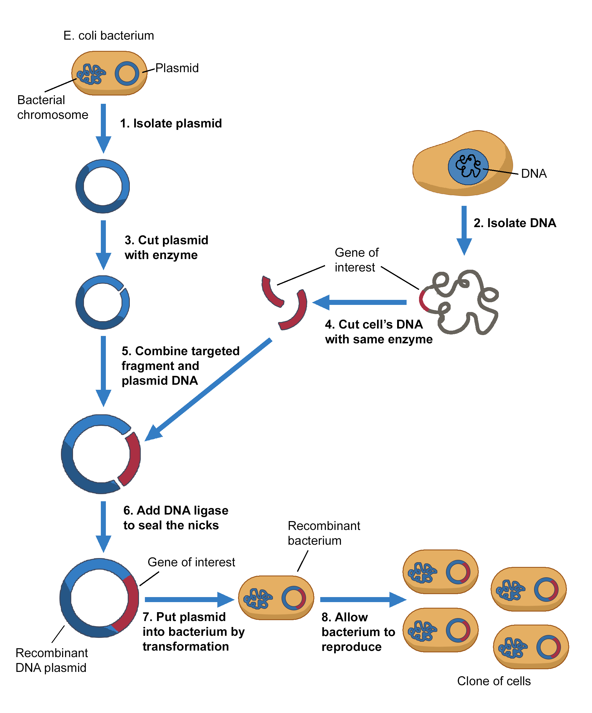

### Procedure

 
The vector acts as a vehicle that transport the foreign gene into a host cell usually a bacterium. When the host cell divides, the recombinant vector also multiplies, generating a huge number of identical copies not only of itself but also of the gene inserted into the vector. After many cell divisions, a clone or a colony of host cells is produced where each clone contains one or more copies of the recombinant DNA molecule.
  

Cloning of GFP gene in a suitable expression vector demands that 
* Isolation of gene of interest (GFP)to be cloned
* The vector DNA must be purified and cut open using a suitable set of restriction endonucleases. The expression vector should also contain selectable marker genes such as ampicillin and kanamycin resistance gene.
* The GFP gene must also be cleaved using same set of restriction endonucleases used to cut the vector DNA. This cleaved GFP gene is then inserted into the suitable vector to create the recombinant DNA molecule by joining reactions known as ligation
* The cutting and joining reactions must be monitored using gel electrophoresis method
* The recombinant DNA molecule produced must be introduced into a suitable host cell like E.coli (transformation).
* The selective propagation of the cell clones involves two stages: 
	(i) The transformed cells are plated by spreading on an agar surface to encourage the growth of the well separated colonies containing the GFP gene. This agar must have the same suitable selectable marker incorporated such as antibiotics like ampicillin, kanamycin to specifically allow the growth of those clones containing the target gene (GFP). 
	(ii) The individuals colonies can be picked from the plate and further propagated in liquid culture for selective isolation of recombinant DNA. 
 
The recombinant DNA is then screened for positive clones by methods such as PCR, restriction mapping etc.

 

  

  <figure class="video_container" style="width: 600px; height: 350px;">
    <iframe style="width: 100%; height: 100%;" src="https://www.youtube.com/embed/videoseries?si=ARcYZU8YJan2BEE5&amp;list=PLTkVi3dAX_--8AgO31qBpg-L2dsEZi_TU" title="YouTube video player" frameborder="0" allow="accelerometer; autoplay; clipboard-write; encrypted-media; gyroscope; picture-in-picture; web-share" referrerpolicy="strict-origin-when-cross-origin" allowfullscreen></iframe>
  </figure>

